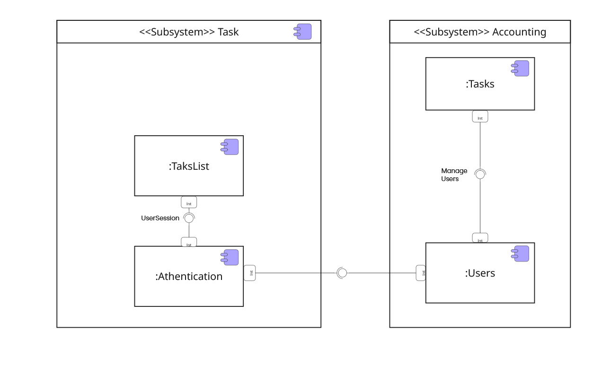
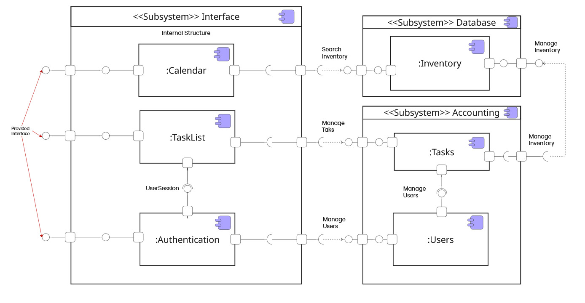

# 2.1.2. Diagrama de Componentes

## Introdução

O diagrama de componentes mostra componentes, interfaces fornecidas e
necessárias, portas, e as relações entre eles. Este tipo de diagramas é usado no
Desenvolvimento Baseado em Componentes (CBD) descrever sistemas com Arquitetura
Orientada a Serviços (SOA).

O desenvolvimento baseado em componentes é baseado em suposições que componentes
podem ser reutilizados e esses componentes podem ser substituídos por algum
outro "equivalente" ou componentes "conformes", se necessário.

Os artefatos que implementam o componente devem ser capazes de ser implantado e
reimplantado de forma independente, por exemplo, para atualizar um sistema
existente.

Aqui segue a aplicação para o app "O que Planejo Fazer".

## Metodologia

Versão 1.0

Versão 1.1

User/Task/Calendar

[Link para o diagrama](miro.com/app/board/uXjVJNoibQE=/)

## Referências Bibliográficas

https://www.uml-diagrams.org/port.html?context=components#google_vignette

## Histórico de Versões

| Versão | Alteração                             | Responsável                                  | Data     | Revisor                                  | Detalhes da Revisão | Data da Revisão |
| ------ | ------------------------------------- | -------------------------------------------- | -------- | ---------------------------------------- | ------------------- | --------------- |
| 1.0    | Adicionando versões do miro ao github | [Siqueira](https://github.com/siqueira-prog) | 21/09/25 | [SEU NOME](https://github.com/SEUGITHUB) | ---                 | XX/XX/XX        |
