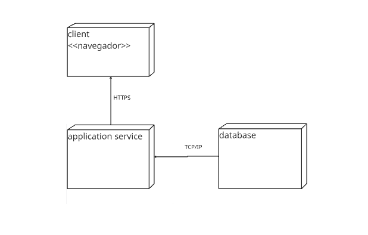
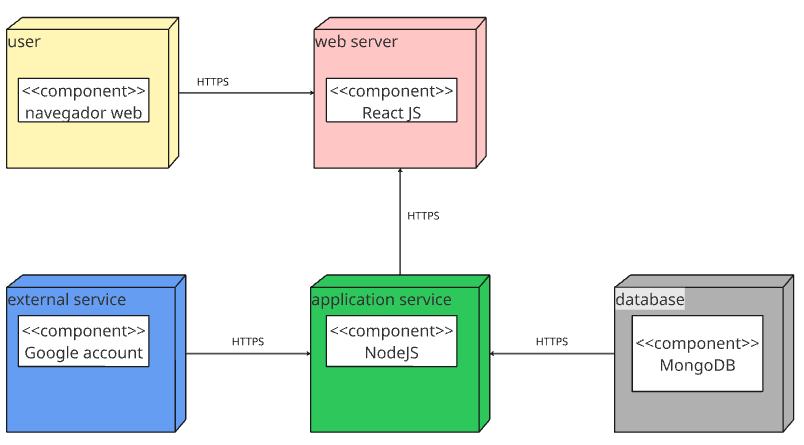

# 2.1.3. Diagrama de Implantação

## Introdução

O Diagrama de Implantação é um diagrama estático da UML que modela a arquitetura física e a topologia de um sistema de hardware e software. Ele visualiza como os componentes de software (artefatos) são distribuídos e implantados nos componentes de hardware (nós).

## Metodologia

Para a construção dos diagramas de implantação, utilizou-se a notação UML (Unified Modeling Language). Para construí-lo utilizamos a ferramenta Miro.

- Versão 1.0: Estrutura básica composta por cliente, serviço de aplicação e banco de dados.
- Versão 1.1: Especificação maior da arquitetura, mencionando tecnologias adotadas (ReactJS, NodeJS, MongoDB) e integração com serviços externos (Google Account).

Critérios de modelagem:

- Identificação dos nós principais.
- Associação de componentes de software aos nós.
- Representação do protocolo de comunicação (HTTPS).

### Versões do Diagrama

#### Versão 1.0

Visão simplificada com três nós principais: cliente, serviço de aplicação e banco de dados.

Este é um diagrama estático que apresenta uma visão de alto nível da arquitetura física do sistema, focando nos seus componentes lógicos principais.

**Características Principais:**

* **Arquitetura de 3 Camadas**: Representa uma clássica arquitetura de três camadas (Three-Tier Architecture):
    1.  **Cliente/Apresentação** (`client <<navegador>>`)
    2.  **Serviço/Aplicação** (`application service`)
    3.  **Banco de Dados** (`database`)
* **Abstração Tecnológica**: Não especifica as tecnologias (frameworks, linguagens) utilizadas, focando apenas na estrutura e na separação das responsabilidades.
* **Protocolos de Comunicação**: Define como as camadas se comunicam, utilizando `HTTPS` para a comunicação segura entre o cliente e o serviço, e `TCP/IP` para a comunicação interna entre o serviço e o banco de dados.

  
  
<em>Imagem 01 - Diagrama de implantação versão 1.0 </em>

#### Versão 1.1

A primeira versão apresentou uma visão simplificada da arquitetura, suficiente para validar os elementos centrais. Entretanto, faltava informações sobre tecnologias e serviços externos.
Na versão 1.1, corrigimos essa limitação, detalhando os componentes específicos, adicionando a camada de servidor web e explicitando a integração com o Google Account.

Este diagrama estático evolui o modelo anterior, detalhando as tecnologias específicas e os nós físicos que compõem a arquitetura do sistema.

**Características Principais:**

* **Stack de Tecnologia Definido**: Especifica as tecnologias a serem utilizadas em cada camada: `React JS` no frontend, `NodeJS` no backend e `MongoDB` como banco de dados.
* **Arquitetura Distribuída**: Mostra um sistema mais distribuído, com nós separados para `web server`, `application service`, e `database`, o que é comum em arquiteturas de microsserviços ou sistemas escaláveis.
* **Dependência de Serviço Externo**: A presença do nó `external service (Google account)` é uma característica fundamental, indicando que o sistema depende de um serviço de terceiros, provavelmente para autenticação (OAuth 2.0) e/ou integração de dados.
* **Comunicação Segura Unificada**: Diferente da visão de alto nível, este diagrama especifica o uso de `HTTPS` para todas as conexões, reforçando a preocupação com a segurança e a criptografia dos dados em trânsito entre todos os componentes da infraestrutura.

  
  
<em>Imagem 02 - Diagrama de implantação versão 1.1 </em>

## Referências Bibliográficas

> IBM. Diagramas de Implementação em Modelagem UML. Disponível em: https://www.ibm.com/docs/pt-br/rsas/7.5.0?topic=topologies-deployment-diagrams. Acesso em 18 de setembro de 2025.
> Slides Milena Serrano -  AULA - MODELAGEM UML ESTÁTICA

## Histórico de Versões

| Versão | Alteração | Responsável | Data | Revisor |  Detalhes da Revisão | Data da Revisão |
|--------|-----------|-------------|------|---------|----------------------|-----------------|
| 1.0 | Adição da primeira versão do diagrama | [Millena](https://github.com/MillenaQueiroz), [Yasmim](https://github.com/yaskisoba), [Nathan](https://github.com/nateejpg) | 20/09/25 | - | ---  | XX/XX/XX |
| 1.1 | Ajuste no diagrama e adição de imagens | [Millena](https://github.com/MillenaQueiroz), [Yasmim](https://github.com/yaskisoba) | 20/09/25 | - | ---  | XX/XX/XX |
| 1.2 | Ajustando MD e arrumando diagrama | [Nathan](https://github.com/nateejpg), [Millena](https://github.com/MillenaQueiroz) | 20/09/25 | - | ---  | XX/XX/XX |