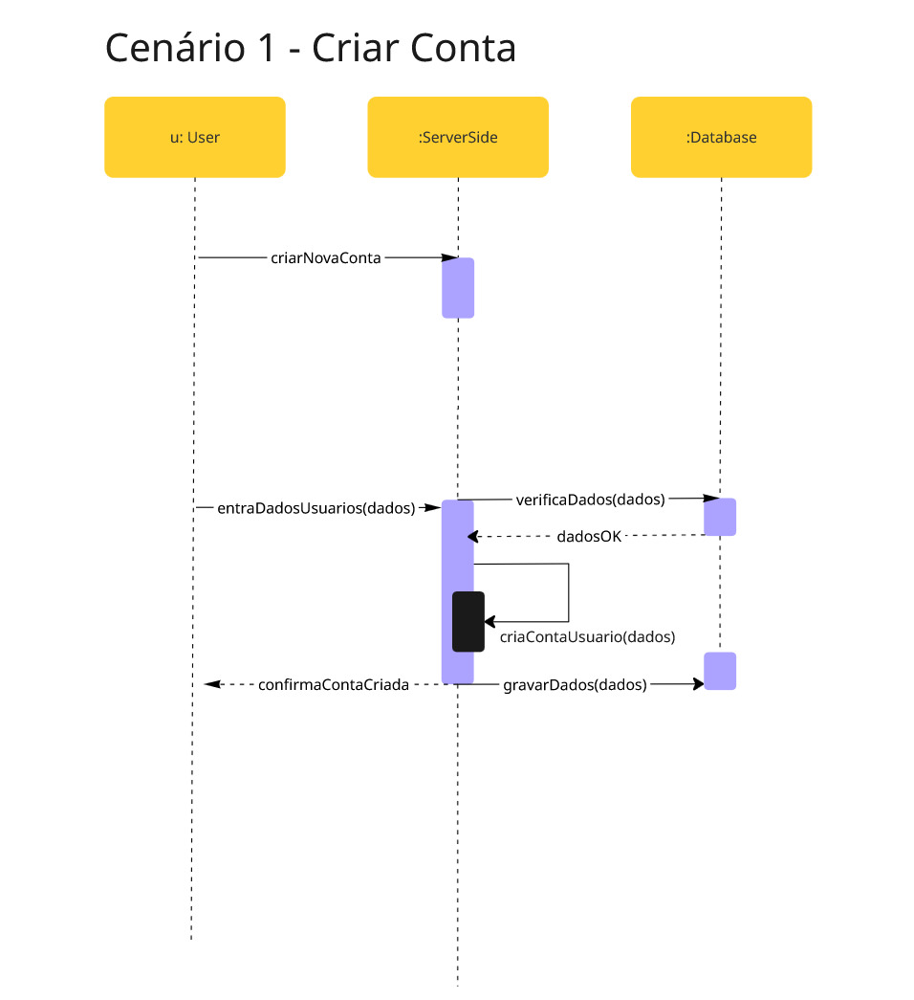
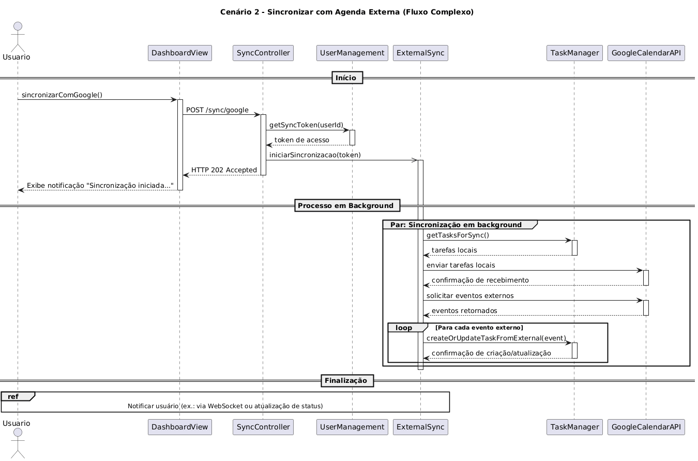
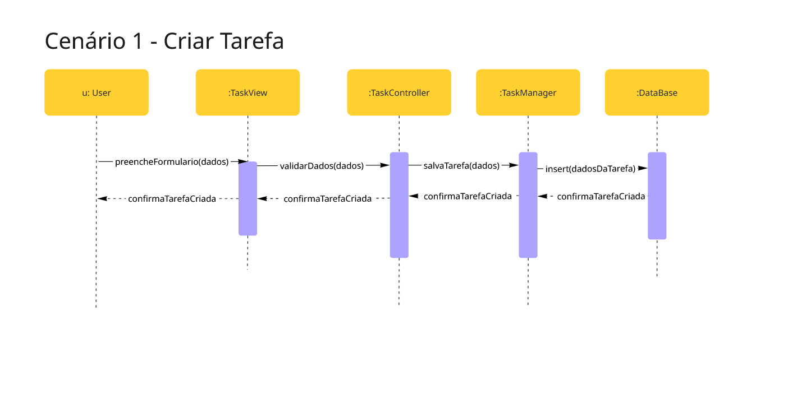

# 2.2.1. Diagrama de Sequência

## Introdução

O diagrama de sequência é o tipo mais comum de diagrama de interação, que se
concentra no intercâmbio de mensagens entre várias linhas de vida.

O diagrama de sequência descreve uma interação, concentrando-se na sequência de
mensagens que são trocadas, juntamente com suas especificações de ocorrência
correspondentes nas linhas de vida.

## Metodologia

## Cenário 1 - Criar Conta

## Cenário 2 - Sincronizar com Agenda Externa

## Cenário 2 - Sincronizar com Agenda Externa (Revisado)

## Cenário 3 - Criar Tarefa

[Link para o diagrama](miro.com/app/board/uXjVJNoibQE=/)

[Documento Sugestões](https://docs.google.com/document/d/16u-tABpAFPpolPuGnBcs7Va7OJkjiwat8BP9SfLE5uQ/edit?usp=sharing)

## Referências Bibliográficas

> https://www.uml-diagrams.org/sequence-diagrams.html#google_vignette

> https://www.visual-paradigm.com/guide/uml-unified-modeling-language/what-is-sequence-diagram/

> https://creately.com/guides/sequence-diagram-tutorial/

> https://www.youtube.com/watch?v=LeV6RO-6Tn4&t=903s

## Histórico de Versões

| Versão | Alteração                             | Responsável                                          | Data     | Revisor                                              | Detalhes da Revisão                                                                 | Data da Revisão |
| ------ | ------------------------------------- | ---------------------------------------------------- | -------- | ---------------------------------------------------- | ----------------------------------------------------------------------------------- | --------------- |
| 1.0    | Adicionando versões do miro ao github | [Siqueira](https://github.com/siqueira-prog)         | 21/09/25 | [Mateus Vinicius](https://github.com/matix0)         | O título dos diagramas estava duplicado, alterei o nome para individualizar cada um | 21/09/25        |
| 1.1    | Adicionando cenário 2                 | [Mateus Vinicius](https://github.com/matix0)         | 21/09/25 | [Matheus Rodrigues](https://github.com/mrodrigues14) | Adicionado um pequeno ajuste de sincronização concluída                             | 21/09/25        |
| 1.2    | Adicionando cenário 2 revisado        | [Matheus Rodrigues](https://github.com/mrodrigues14) | 22/09/25 | [Mateus Vinicius](https://github.com/matix0)         | Adicionado links de referências e formatação da página                              | 22/09/25        |
