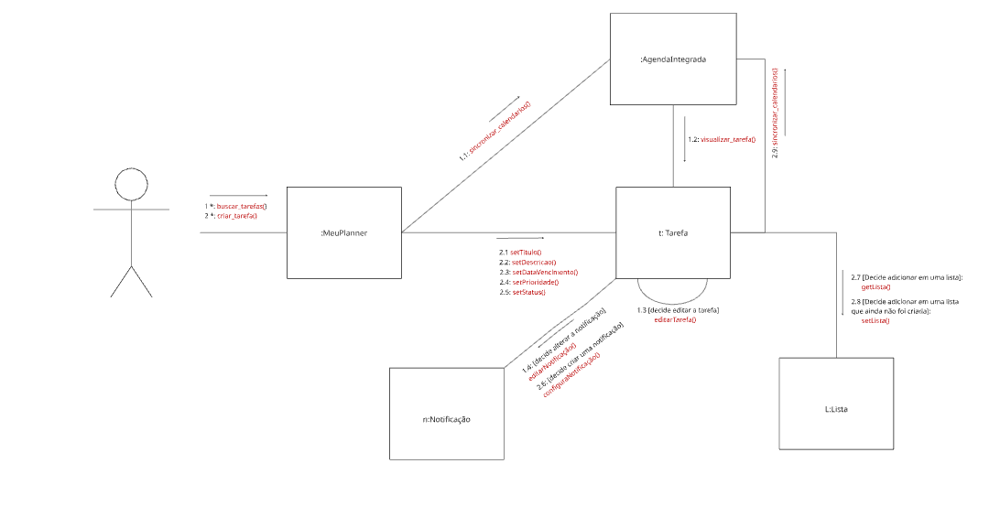

# 2.2.3. Diagrama de Comunicação

## Introdução

O Diagrama de Comunicação, anteriormente conhecido como Diagrama de Colaboração, é um diagrama dinâmico da UML que mostra a interação entre objetos e/ou partes de um sistema utilizando mensagens sequenciais. Sua ênfase está na ordem das mensagens e nas relações entre os objetos, normalmente com foco em um cenário de um caso de uso específico (SERRANO, 2025).

Este diagrama é fundamental para detalhar a implementação de um caso de uso, ilustrando quais objetos são necessários e como eles trocam mensagens para realizar uma determinada funcionalidade. Ele fornece uma visão clara da distribuição de responsabilidades no nível dos objetos.

## Metodologia

A construção do diagrama de comunicação seguiu uma metodologia baseada em cenários para garantir que o fluxo de interação fosse representado de forma precisa.

- **Definição do Cenário**: O diagrama foi modelado com base no caso de uso "Criar Tarefa", uma funcionalidade central da aplicação que requer a colaboração de múltiplos objetos.
- **Identificação dos Participantes**: Foram identificados os objetos que participam do cenário, incluindo o Ator (usuário), o orquestrador `:MeuPlanner`, a entidade `:Tarefa` e seus colaboradores `:AgendaIntegrada`, `:Notificação` e `:Lista`.
- **Mapeamento de Interações**: O fluxo de eventos do caso de uso foi traduzido em mensagens numeradas, que representam a sequência lógica das chamadas de método entre os objetos para completar a operação.

Para a elaboração visual do diagrama, foi utilizada a ferramenta Miro, seguindo a notação padrão da UML.

## Diagrama
O diagrama foca em detalhar o fluxo principal para a criação e manipulação de tarefas no sistema.
Este diagrama dinâmico ilustra a sequência de interações entre objetos para realizar as funcionalidades de buscar e criar tarefas no sistema.

**Características Principais:**

* **Fluxo Iniciado pelo Ator**: A interação é sempre iniciada por um usuário (ator), que aciona os eventos principais no sistema, como `buscar_tarefa()` e `criar_tarefa()`.
* **Objeto Orquestrador**: A entidade `:MeuPlanner` funciona como um controlador ou orquestrador central, recebendo as requisições do usuário e gerenciando o fluxo de criação e configuração dos outros objetos.
* **Sequência Lógica**: A numeração das mensagens (ex: `2.1`, `2.2`, `2.3`) define a ordem precisa em que as operações ocorrem, mostrando o passo a passo da criação de uma tarefa.
* **Modularidade**: O diagrama revela um sistema com responsabilidades bem divididas entre diferentes objetos: `:Tarefa` (entidade principal), `:AgendaIntegrada` (sincronização externa), `:Notificação` (alertas) e `:Lista` (organização).
* **Lógica Condicional**: As anotações como `[Decide adicionar em uma lista]` indicam que existem regras de negócio e pontos de decisão dentro do fluxo de execução.

  
  
<em>Imagem 01 - Diagrama de comunicação </em>

## Referências Bibliográficas

> IBM. Diagramas de Comuniação em Modelagem UML. Disponível em: https://www.ibm.com/docs/pt-br/rational-soft-arch/10.0?topic=diagrams-communication. Acesso em 21 de set. 2025.

> PRESSMAN, Roger S. Engenharia de Software: uma abordagem profissional. 7. ed. Porto Alegre: AMGH, 2011.

> SERRANO, Milene. Arquitetura e Desenho de Software: Modelagem UML Dinãmica. Disponível em: [Conteúdo em PDF](https://aprender3.unb.br/pluginfile.php/3178534/mod_page/content/1/Arquitetura%20e%20Desenho%20de%20Software%20-%20Aula%20Modelagem%20UML%20Din%C3%A2mica%20-%20Profa.%20Milene.pdf). Acesso em: 21 set. 2025.

## Histórico de Versões

| Versão | Alteração | Responsável | Data | Revisor |  Detalhes da Revisão | Data da Revisão |
|--------|-----------|-------------|------|---------|----------------------|-----------------|
| 1.0 |Criação do diagrama de comunicação e da sua documentação! |[Millena](https://github.com/MillenaQueiroz), [Yasmim](https://github.com/yaskisoba), [Nathan](https://github.com/nateejpg) | 21/09/2025 | [Camila Careli](https://github.com/camilascareli) | Imagem da Versão 1.0 está quebrada.   Sugestões: linkar referências, como: SERRANO, 2025; Caso de uso "Criar tarefa".  | 21/09/25 |
| 1.1 | Ajuste da imagem quebrada | [Yasmim Rosa](https://github.com/yaskisoba) | 21/09/2025 | - | -  | - |
