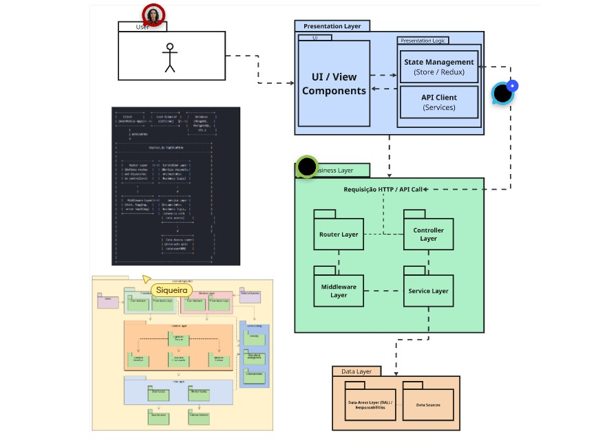

# 2.3.1. Diagrama de Pacotes

## Introdução

Um diagrama de pacotes é um tipo de diagrama de estrutura na Unified Modeling Language (UML) usado para organizar elementos de um sistema em grupos lógicos com base em suas funcionalidades e dependências. Ele ajuda a visualizar a arquitetura de alto nível de um sistema, mostrando como os diferentes componentes (pacotes) são organizados e como interagem entre si. Pacotes são usados para agrupar classes, interfaces, componentes e outros diagramas, facilitando a compreensão e a manutenção de sistemas complexos.

## Metodologia e Organização das Equipes

Para a etapa de modelagem UML, foi realizada uma análise da complexidade de cada diagrama e do número de integrantes do grupo. Com base nisso, a separação das equipes foi estruturada com o objetivo de manter os mesmos membros agrupados sempre que possível. Essa abordagem visa otimizar a comunicação e a sincronia entre os times. A divisão foi projetada para equilibrar a carga de trabalho das equipes. Para a modelagem organizacional, que exige uma visão ampla do sistema, uma equipe base foi unida a uma das duplas da Equipe A, garantindo capacidade suficiente para a demanda. Ficaram responsáveis pelob Diagrama de Pacotes Maria Clara e Daniel, da Equipe A; e a Equipe B: Mateus Siqueira, Mateus Vinicius e Matheus Rodrigues.

A elaboração do Diagrama de Pacotes seguiu uma metodologia de análise arquitetural, partindo de uma visão macro do sistema e de seus requisitos. O processo incluiu as seguintes etapas:

- **Identificação dos Agrupamentos Lógicos**: Os elementos do sistema, como classes e funcionalidades, foram analisados para identificar afinidades e responsabilidades comuns. 
- **Definição dos Pacotes e seus Conteúdos**: Para cada agrupamento identificado, foi criado um pacote. As convenções de nomeação da UML foram seguidas para garantir clareza. O conteúdo de cada pacote foi definido, agrupando os elementos que fazem sentido estarem juntos.
- **Estabelecimento das Dependências**: As relações entre os pacotes foram mapeadas para mostrar como eles interagem. Foi utilizada a relação de dependência para indicar que um pacote utiliza funcionalidades ou elementos de outro. Isso ajuda a visualizar o acoplamento entre os módulos do sistema.
- **Hierarquização e Refinamento**: Os pacotes foram organizados em uma estrutura hierárquica, quando necessário, para representar diferentes níveis de abstração. Pacotes maiores foram divididos em subpacotes para detalhar ainda mais a organização interna de um módulo.

Essa abordagem garantiu um diagrama claro e bem estruturado, que reflete a arquitetura modular do projeto e serve como um mapa para a navegação e o desenvolvimento do código.

### Pesquisa Inicial

 Rascunho da introdução, sugestão da composição do diagrama e pesquisa incial a respeito do artefato.

  
  
  

<em>Autor(a): <a href="https://github.com/alvezclari">Maria Clara</a></em>

## Versões do Diagrama

Versão 2.0

Versão 2.1

## Referências Bibliográficas

> **LUCIDCHART**. *Tutorial sobre diagramas de pacotes UML*. Disponível em: <https://www.lucidchart.com/pages/pt/diagrama-de-pacotes-uml>. Acesso em: 19 set. 2025.

> **VISUAL PARADIGM**. *What is Package Diagram?* Disponível em: <https://www.visual-paradigm.com/guide/uml-unified-modeling-language/what-is-package-diagram/>. Acesso em: 19 set. 2025.

‌
## Histórico de Versões

| Versão | Alteração | Responsável | Data | Revisor |  Detalhes da Revisão | Data da Revisão |
|--------|-----------|-------------|------|---------|----------------------|-----------------|
|  1.0 | adiciona introdução, metodologia e referências | [Clara](https://github.com/alvezclari) | 19/09/2025 |
|  2.0 | Adicionando primeiros diagramas | [Siqueira](https://github.com/siqueira-prog) | 21/09/2025 ||  |  | |
|  2.1 | Adicionando aprimoramento do diagrama de pacotes| [Nathan Abreu](https://github.com/nateejpg) | 21/09/2025 ||  |  | |

